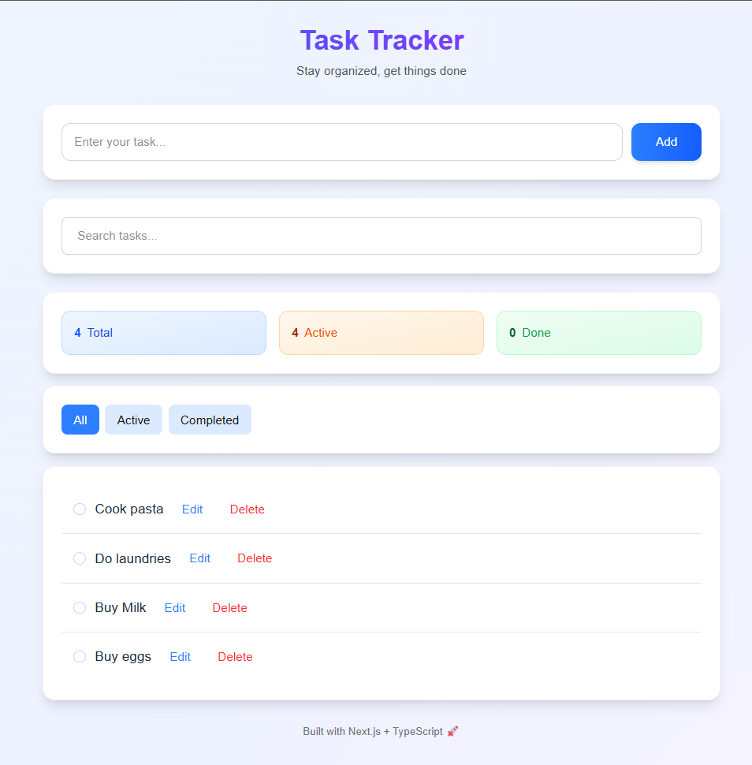
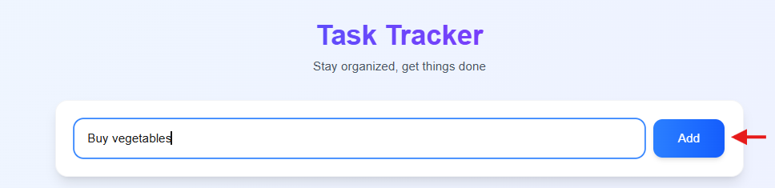
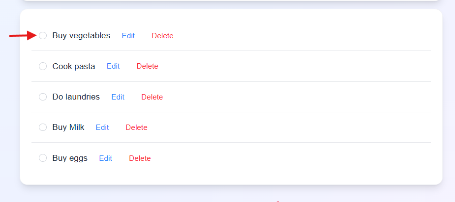
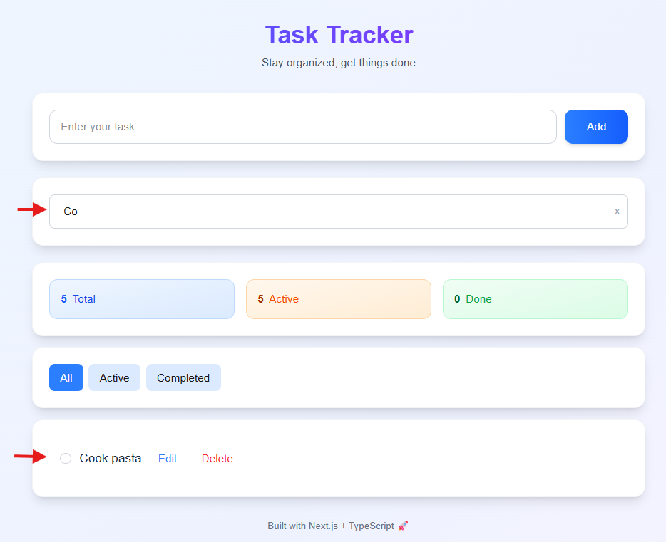

# 📝 Task Tracker

A modern, feature-rich task management application built with **Next.js 16**, **TypeScript**, and **Tailwind CSS**. This project demonstrates professional React patterns, component architecture, and clean code practices.


## 🎯 Overview

Task Tracker is a responsive web application that helps users manage their daily tasks efficiently. Built with modern web technologies and following React best practices, this project showcases component-based architecture, state management, and TypeScript integration.

**Repository:** [GitHub Link](https://github.com/maeeshamaliha22/task-tracker)

---

## ✨ Features

### Core Functionality

- ✅ **Add Tasks** - Quick task creation
- ✅ **Edit Tasks** - Inline editing with save/cancel options
- ✅ **Delete Tasks** - Remove unwanted tasks
- ✅ **Toggle Completion** - Mark tasks as complete/incomplete
- ✅ **Persistent Storage** - Tasks saved locally across sessions

### Advanced Features

- 🔍 **Real-time Search** - Filter tasks by title (case-insensitive)
- 🎯 **Status Filters** - View All, Active, or Completed tasks
- 📊 **Statistics Dashboard** - Track total, active, and completed tasks
- 🎨 **Modern UI/UX** - Gradient design with smooth animations

---

## 🛠️ Technologies Used

### Frontend

- **[Next.js 16](https://nextjs.org/)** - React framework with App Router
- **[TypeScript](https://www.typescriptlang.org/)** - Type-safe JavaScript
- **[React 19](https://react.dev/)** - UI library with hooks
- **[Tailwind CSS](https://tailwindcss.com/)** - Utility-first CSS framework

### Tools & Practices

- **Component Architecture** - Modular, reusable components
- **TypeScript Interfaces** - Strict type checking
- **React Hooks** - useState, useEffect for state management
- **Local Storage API** - Browser-based data persistence
- **Git** - Version control with conventional commits

---

## 🏗️ Project Structure

```
app/
├── page.tsx                    # Main page (parent component)
├── layout.tsx                  # Root layout
├── globals.css                 # Global styles
│
├── types/
│   └── task.ts                # TypeScript type definitions
│
└── components/
    ├── Header.tsx             # App header and title
    ├── TaskInput.tsx          # Task creation form
    ├── SearchFilter.tsx       # Search controls
    ├── Statistics.tsx         # Stats cards display
    ├── FilterButtons.tsx      # Filter tasks by type
    ├── TaskList.tsx           # Task list container
    └── TaskItem.tsx           # Individual task item
```

---

### Key Design Decisions

---

1. **Single Source of Truth** - All tasks stored in parent component
2. **Props Down, Callbacks Up** - Data flows down via props, actions flow up via callbacks
3. **Separation of Concerns** - Each component has a single responsibility
4. **Type Safety** - TypeScript interfaces for all data structures

---

## 🧪 Features Showcase

### 1. Search Functionality

- Real-time filtering as you type
- Case-insensitive matching
- Clear button to reset search

### 2. Filter Options

- **All** - Shows all tasks
- **Active** - Shows only incomplete tasks
- **Completed** - Shows only completed tasks
- Each filter shows count in badge

### 3. Task Operations

- **Toggle** - Click checkbox to mark complete
- **Edit** - Click Edit → Modify → Save/Cancel
- **Delete** - Remove task permanently
- **Clear Completed** - Bulk delete all done tasks

---

## 🎯 Learning Outcomes

This project demonstrates proficiency in:

### React Concepts

- ✅ Component composition and architecture
- ✅ Props and prop drilling
- ✅ State management with hooks
- ✅ Controlled components
- ✅ Conditional rendering
- ✅ Event handling

### TypeScript

- ✅ Interface definitions
- ✅ Type annotations
- ✅ Union types
- ✅ Type-safe props

### Next.js

- ✅ App Router structure
- ✅ Client components
- ✅ File-based routing

### Best Practices

- ✅ Clean code principles
- ✅ Component reusability
- ✅ Separation of concerns
- ✅ Immutable state updates
- ✅ Descriptive naming conventions

---

## 👤 Author

**Maeesha Maliha**

- GitHub : [@maeeshamaliha22](https://github.com/maeeshamaliha22)
- LinkedIn : [Maeesha Maliha](https://www.linkedin.com/in/maeesha-maliha-56159bb3/)

---

## 🙏 Acknowledgments

- Next.js team for the amazing framework
- Tailwind CSS for the utility-first approach
- React community for best practices
- TypeScript for type safety

---

## 📸 Screenshots

### Main Interface



### Task Management





### Search and Filter



---
